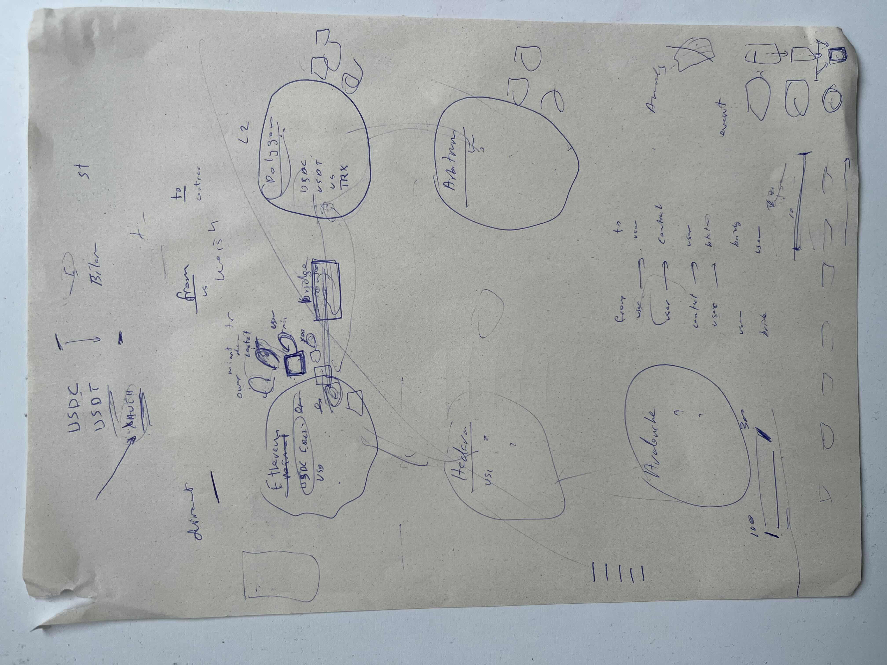
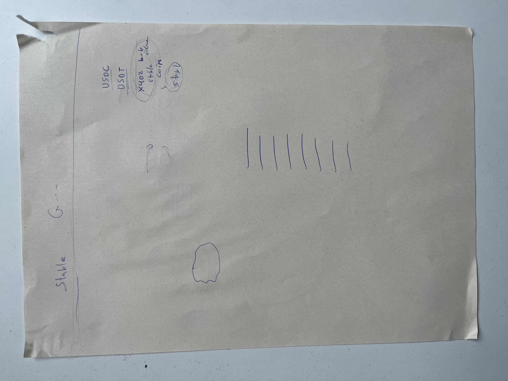

## Meeting – 2026-02-12

### Discussed Points
- Focus on `stablecoin transactions` only. USDC, USDT, maybe EUR, TRY, JPY and XAU stablecoins.
- `Target networks`: Ethereum, Polygon (L2), Arbitrum, Avalanche, Hedera.
- `Extract` and `classify` `transfer flows` using events.
- Identify `mint`, `transfer`, and `bridge` operations (e.g., ETH ↔ Polygon).
- Construct directed weighted graphs and apply `PageRank / Max Flow`.
- Classify addresses (user, contract, DEX, exchange).

### Action Items
- Reserach and familiarize with all discussed concepts and tools.
- Finalize initial network and stablecoin scope.
- Research ERC20 `transfer events`and `log extraction`.
- Investigate `bridge contract` behavior.
- Define `address classification` approach.
- Design basic graph structure (nodes, edges, weights).
- Optionally research if `broker address sources` can be found easily (e.g., Kraken, BTCTurk, Binance).

### Images (Optional)

